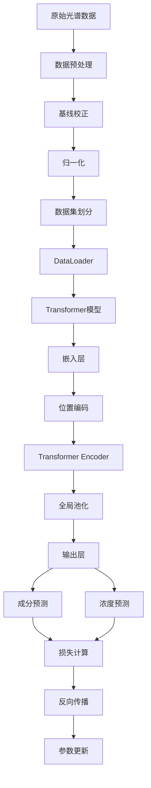

# Transformer拉曼光谱混合物分析 - 使用指南

> 完整的项目使用说明

## 📖 如何阅读本文档

**根据您的经验水平选择阅读路径：**

### 🚀 快速上手（5分钟）
1. [快速开始](#快速开始)
2. [核心命令速查](#核心命令速查)

### 📚 完整学习（适合初学者）
1. [项目简介](#项目简介)
2. [详细使用教程](#详细使用教程)
3. [输出结果解读](#输出结果解读)
4. [常见问题](#常见问题)

### 🔧 开发定制（适合开发者）
1. [项目架构解析](#项目架构解析)
2. [参数配置详解](#参数配置详解)
3. [开发者指南](#开发者指南)

---

## 📋 目录

- [项目简介](#项目简介)
- [快速开始](#快速开始)
- [核心命令速查](#核心命令速查)
- [详细使用教程](#详细使用教程)
- [输出结果解读](#输出结果解读)
- [项目架构解析](#项目架构解析)
- [参数配置详解](#参数配置详解)
- [开发者指南](#开发者指南)
- [常见问题](#常见问题)
- [性能优化建议](#性能优化建议)

---

## 项目简介

### 项目背景

拉曼光谱是一种非破坏性的分析技术，广泛应用于药物成分分析、材料鉴定等领域。传统的光谱分析方法依赖化学计量学和专家经验，而本项目利用深度学习中的Transformer架构，实现了自动化的混合物成分识别和浓度预测。

### 技术特点

- **自注意力机制**：Transformer的核心优势，能够捕捉光谱中不同波长之间的长距离依赖关系
- **位置编码**：保留波长位置信息，使模型理解光谱的顺序结构
- **多任务学习**：同时训练成分识别和浓度预测，共享底层特征表示
- **端到端学习**：从原始光谱直接预测结果，无需手工特征工程

### 适用场景

- ✅ 药物混合物快速筛查
- ✅ 药品质量控制
- ✅ 假药检测
- ✅ 成分定量分析
- ✅ 光谱数据深度学习研究

### 前置要求

**必须**：
- 已完成环境配置（参见[环境配置.md](环境配置.md)）
- Python 3.8-3.11环境
- 基本的Python编程知识

**推荐**（非必须）：
- 了解深度学习基础概念
- 了解PyTorch框架
- 了解拉曼光谱原理

---

## 快速开始

### 三步启动流程

```bash
# 步骤1：激活环境
conda activate use

# 步骤2：进入项目目录（替换为您的实际路径）
cd "D:\日常事务\李老师事务\2025编书系统工程与管理工程书\2025.10\所有程序\Transformer模型"

# 步骤3：运行快速测试
python quick_start.py
```

### 完整工作流

```bash
# 1. 快速测试（推荐首次运行）
python quick_start.py
```

---

## 核心命令速查

### 基础操作

```bash
# 环境激活
conda activate use

# 快速测试（包含数据生成、模型创建、训练演示）
python quick_start.py
```

### 配置查看

```python
# 在Python中查看配置
import config

# 查看设备
print(config.DEVICE)

# 查看模型配置
print(config.MODEL_CONFIG)

# 查看数据配置
print(config.DATA_CONFIG)
```

---

## 详细使用教程

### 步骤1：快速测试程序

**目的**：验证环境配置正确，了解项目基本功能

#### 运行命令

```bash
python quick_start.py
```

#### 程序流程

quick_start.py演示了完整的工作流程：

1. **数据生成演示**
   - 创建10个混合物样本
   - 显示光谱形状和成分信息

2. **模型创建演示**
   - 初始化Transformer模型
   - 显示模型参数量（约81万参数）

3. **前向传播演示**
   - 对4个样本进行预测
   - 显示输出形状和示例结果

4. **简单训练演示**
   - 生成20个训练样本
   - 训练5个epoch
   - 显示损失变化

#### 输出示例

```
欢迎使用Transformer拉曼光谱混合物分析系统
使用设备: cpu

================================================================================
1. 数据生成演示
================================================================================

生成的数据:
  光谱形状: (10, 1738)
  成分标签形状: (10, 5)
  浓度形状: (10, 5)
  光谱范围: [-0.123, 1.456]

前3个混合物的成分:

  混合物1:
    对乙酰氨基酚: 0.523
    咖啡因: 0.477
    
  混合物2:
    阿司匹林: 1.000
    
  混合物3:
    布洛芬: 0.631
    萘普生: 0.369
...
```

#### 重点说明

- **设备信息**：显示当前使用CPU还是GPU
- **数据形状**：(样本数, 特征维度)
- **模型参数**：参数越多，模型容量越大，但训练时间越长
- **损失变化**：正常情况下损失应该逐渐下降

---

### 步骤2：数据生成与预处理

**目的**：了解如何生成和处理拉曼光谱数据

#### 数据生成

```python
from data import RamanMixtureGenerator
import config

# 创建数据生成器
generator = RamanMixtureGenerator(
    num_mixtures=config.NUM_MIXTURES,  # 80个混合物
    random_seed=42  # 固定随机种子以保证可重复性
)

# 生成数据集
spectra, component_labels, concentrations = generator.generate_dataset()

print(f"光谱形状: {spectra.shape}")  # (80, 1738)
print(f"成分标签形状: {component_labels.shape}")  # (80, 5)
print(f"浓度形状: {concentrations.shape}")  # (80, 5)
```

#### 数据格式说明

- **spectra**: 拉曼光谱数据，形状为(N, 1738)
  - N: 样本数量
  - 1738: 波数范围400-2000 cm⁻¹的采样点数

- **component_labels**: 成分标签，形状为(N, 5)
  - 多标签分类格式
  - 1表示该成分存在，0表示不存在
  - 示例：[1, 1, 0, 0, 0] 表示包含阿司匹林和对乙酰氨基酚

- **concentrations**: 浓度值，形状为(N, 5)
  - 归一化后的相对浓度
  - 所有成分浓度之和为1.0
  - 示例：[0.6, 0.4, 0, 0, 0] 表示60%阿司匹林和40%对乙酰氨基酚

#### 数据预处理

```python
from utils.preprocessing import preprocess_spectrum

# 预处理光谱（基线校正 + 归一化）
processed_spectra = preprocess_spectrum(
    spectra,
    baseline_correction_method='poly',  # 多项式基线校正
    normalization_method='minmax',      # 最小-最大归一化
    degree=3                            # 多项式阶数
)

# 可选：标准归一化
processed_spectra_std = preprocess_spectrum(
    spectra,
    baseline_correction_method='als',   # 自适应最小二乘法
    normalization_method='standard'     # 标准归一化（均值0，方差1）
)
```

#### 数据可视化

```python
import matplotlib.pyplot as plt
import config

# 设置中文字体
plt.rcParams['font.sans-serif'] = ['SimHei', 'Microsoft YaHei']
plt.rcParams['axes.unicode_minus'] = False

# 创建波数坐标
wavenumbers = np.linspace(
    config.RAMAN_SHIFT_RANGE[0],
    config.RAMAN_SHIFT_RANGE[1],
    config.INPUT_DIM
)

# 绘制原始光谱vs预处理后光谱
fig, axes = plt.subplots(2, 1, figsize=(12, 8))

# 原始光谱
axes[0].plot(wavenumbers, spectra[0])
axes[0].set_title('原始拉曼光谱')
axes[0].set_xlabel('波数 (cm⁻¹)')
axes[0].set_ylabel('强度')
axes[0].grid(True, alpha=0.3)

# 预处理后光谱
axes[1].plot(wavenumbers, processed_spectra[0])
axes[1].set_title('预处理后光谱')
axes[1].set_xlabel('波数 (cm⁻¹)')
axes[1].set_ylabel('归一化强度')
axes[1].grid(True, alpha=0.3)

plt.tight_layout()
plt.savefig('spectrum_comparison.png', dpi=150, transparent=True)
plt.close()
```

---

### 步骤3：模型创建与训练

**目的**：了解如何创建和训练Transformer模型

#### 创建模型

```python
from models import create_model
import config

# 创建模型
model = create_model()

# 移动到设备
model = model.to(config.DEVICE)

# 查看模型信息
model_info = model.get_model_info()
print("模型信息:")
for key, value in model_info.items():
    if isinstance(value, int):
        print(f"  {key}: {value:,}")
    else:
        print(f"  {key}: {value}")
```

#### 准备数据集

```python
from utils.dataset import SpectrumDataset
from torch.utils.data import DataLoader
import torch

# 预处理数据
from utils.preprocessing import preprocess_spectrum
spectra_processed = preprocess_spectrum(spectra, 'poly', 'minmax', degree=3)

# 创建数据集
dataset = SpectrumDataset(spectra_processed, component_labels, concentrations)

# 划分训练集、验证集、测试集
train_size = int(0.7 * len(dataset))
val_size = int(0.15 * len(dataset))
test_size = len(dataset) - train_size - val_size

train_dataset, val_dataset, test_dataset = torch.utils.data.random_split(
    dataset, [train_size, val_size, test_size]
)

# 创建数据加载器
train_loader = DataLoader(
    train_dataset,
    batch_size=config.BATCH_SIZE,
    shuffle=True
)

val_loader = DataLoader(
    val_dataset,
    batch_size=config.BATCH_SIZE,
    shuffle=False
)

test_loader = DataLoader(
    test_dataset,
    batch_size=config.BATCH_SIZE,
    shuffle=False
)

print(f"训练集: {len(train_dataset)} 样本")
print(f"验证集: {len(val_dataset)} 样本")
print(f"测试集: {len(test_dataset)} 样本")
```

#### 完整训练流程

```python
from utils.metrics import evaluate_model, MultiTaskMetrics, calculate_loss
import torch.optim as optim

# 定义优化器和学习率调度器
optimizer = optim.Adam(
    model.parameters(),
    lr=config.LEARNING_RATE,
    weight_decay=config.WEIGHT_DECAY
)

scheduler = optim.lr_scheduler.ReduceLROnPlateau(
    optimizer,
    mode='min',
    factor=config.LR_SCHEDULER['factor'],
    patience=config.LR_SCHEDULER['patience'],
    min_lr=config.LR_SCHEDULER['min_lr']
)

# 早停机制
best_val_loss = float('inf')
patience_counter = 0

# 训练循环
for epoch in range(1, config.EPOCHS + 1):
    # ===== 训练阶段 =====
    model.train()
    train_loss = 0.0
    
    for batch_spectra, batch_labels, batch_conc in train_loader:
        # 移动到设备
        batch_spectra = batch_spectra.to(config.DEVICE)
        batch_labels = batch_labels.to(config.DEVICE)
        batch_conc = batch_conc.to(config.DEVICE)
        
        # 前向传播
        optimizer.zero_grad()
        comp_pred, conc_pred = model(batch_spectra)
        
        # 计算损失
        loss, class_loss, reg_loss = calculate_loss(
            comp_pred, batch_labels,
            conc_pred, batch_conc
        )
        
        # 反向传播
        loss.backward()
        optimizer.step()
        
        train_loss += loss.item()
    
    train_loss /= len(train_loader)
    
    # ===== 验证阶段 =====
    metrics, val_loss, _, _ = evaluate_model(model, val_loader, config.DEVICE)
    
    # 学习率调度
    scheduler.step(val_loss)
    
    # 打印进度
    if epoch % 5 == 0:
        print(f"Epoch {epoch}/{config.EPOCHS}")
        print(f"  训练损失: {train_loss:.4f}")
        print(f"  验证损失: {val_loss:.4f}")
        print(f"  验证F1: {metrics['classification']['f1']:.4f}")
        print(f"  验证R²: {metrics['regression']['r2']:.4f}")
    
    # 早停检查
    if val_loss < best_val_loss:
        best_val_loss = val_loss
        patience_counter = 0
        # 保存最佳模型
        torch.save(model.state_dict(), config.MODEL_SAVE_PATH)
        print(f"  → 保存最佳模型（验证损失: {val_loss:.4f}）")
    else:
        patience_counter += 1
        if patience_counter >= config.EARLY_STOPPING_PATIENCE:
            print(f"\n早停触发！已{patience_counter}个epoch无改善")
            break

print("\n训练完成！")
```

---

### 步骤4：模型评估

**目的**：评估模型在测试集上的性能

```python
from utils.metrics import evaluate_model, MultiTaskMetrics

# 加载最佳模型
model.load_state_dict(torch.load(config.MODEL_SAVE_PATH))

# 评估
metrics, test_loss, class_loss, reg_loss = evaluate_model(
    model, test_loader, config.DEVICE
)

# 打印评估结果
metrics_calc = MultiTaskMetrics()
print("\n" + "=" * 80)
print("测试集评估结果")
print("=" * 80)
metrics_calc.print_metrics(metrics, prefix="测试集 ")
```

---

### 步骤5：模型推理

**目的**：使用训练好的模型进行预测

```python
import numpy as np
import torch

# 加载模型
model = create_model()
model.load_state_dict(torch.load(config.MODEL_SAVE_PATH))
model.eval()
model = model.to(config.DEVICE)

# 准备单个样本
sample_spectrum = spectra_processed[0]  # 取第一个样本
sample_tensor = torch.FloatTensor(sample_spectrum).unsqueeze(0).to(config.DEVICE)

# 预测
with torch.no_grad():
    component_pred, concentration_pred = model(sample_tensor)

# 转换为numpy
component_pred = component_pred.cpu().numpy()[0]
concentration_pred = concentration_pred.cpu().numpy()[0]

# 二值化成分预测（阈值0.5）
component_binary = (component_pred > 0.5).astype(int)

# 打印结果
print("\n预测结果:")
print("=" * 50)
for i, name in enumerate(config.COMPONENT_NAMES):
    if component_binary[i] == 1:
        print(f"  {name}:")
        print(f"    存在概率: {component_pred[i]:.3f}")
        print(f"    预测浓度: {concentration_pred[i]:.3f}")

# 打印真实值（如果有）
print("\n真实值:")
print("=" * 50)
for i, name in enumerate(config.COMPONENT_NAMES):
    if component_labels[0, i] == 1:
        print(f"  {name}:")
        print(f"    真实浓度: {concentrations[0, i]:.3f}")
```

---

## 输出结果解读

### 分类指标

#### Exact Match Ratio（完全匹配率）

**定义**：所有成分标签都预测正确的样本比例

**计算公式**：
$$\text{EMR} = \frac{1}{N}\sum_{i=1}^{N}\mathbb{1}(\hat{y}_i = y_i)$$

式中，$$N$$为样本数；$$\hat{y}_i$$为第$$i$$个样本的预测标签；$$y_i$$为真实标签；$$\mathbb{1}(\cdot)$$为指示函数。

**意义**：
- 衡量多标签分类的严格准确性
- 值越接近1越好
- 期望值：>0.80为优秀

#### Hamming Loss（汉明损失）

**定义**：平均每个样本预测错误的标签比例

**计算公式**：
$$\text{Hamming Loss} = \frac{1}{N \times L}\sum_{i=1}^{N}\sum_{j=1}^{L}\mathbb{1}(\hat{y}_{ij} \neq y_{ij})$$

式中，$$L$$为标签数（本项目中$$L=5$$）；$$\hat{y}_{ij}$$为第$$i$$个样本第$$j$$个标签的预测值。

**意义**：
- 衡量标签级别的平均错误率
- 值越接近0越好
- 期望值：<0.15为优秀

#### F1-score（F1分数）

**定义**：精确率和召回率的调和平均

**计算公式**：
$$\text{F1} = 2 \times \frac{\text{Precision} \times \text{Recall}}{\text{Precision} + \text{Recall}}$$

**意义**：
- 综合考虑精确率和召回率
- 值越接近1越好
- 期望值：>0.85为优秀

### 回归指标

#### RMSE（均方根误差）

**定义**：预测值与真实值差的平方的平均值的平方根

**计算公式**：
$$\text{RMSE} = \sqrt{\frac{1}{N \times L}\sum_{i=1}^{N}\sum_{j=1}^{L}(\hat{c}_{ij} - c_{ij})^2}$$

式中，$$\hat{c}_{ij}$$为第$$i$$个样本第$$j$$个成分的预测浓度；$$c_{ij}$$为真实浓度。

**意义**：
- 衡量浓度预测的平均误差
- 单位与浓度相同
- 期望值：<0.10为优秀（相对浓度）

#### MAE（平均绝对误差）

**定义**：预测值与真实值差的绝对值的平均

**计算公式**：
$$\text{MAE} = \frac{1}{N \times L}\sum_{i=1}^{N}\sum_{j=1}^{L}|\hat{c}_{ij} - c_{ij}|$$

**意义**：
- 衡量浓度预测的平均绝对偏差
- 对异常值不如RMSE敏感
- 期望值：<0.08为优秀（相对浓度）

#### R²（决定系数）

**定义**：模型解释的方差占总方差的比例

**计算公式**：
$$R^2 = 1 - \frac{\sum_{i,j}(\hat{c}_{ij} - c_{ij})^2}{\sum_{i,j}(c_{ij} - \bar{c})^2}$$

式中，$$\bar{c}$$为所有浓度值的平均值。

**意义**：
- 衡量模型的拟合优度
- 值越接近1越好
- 期望值：>0.90为优秀

---

## 项目架构解析

### 目录结构详解

```
Transformer模型/
│
├── config.py                 # 全局配置文件
│   └── 包含所有超参数、路径、设备配置
│
├── quick_start.py            # 快速开始脚本
│   └── 演示完整工作流程
│
├── models/                   # 模型定义模块
│   ├── __init__.py           # 模块导出
│   ├── transformer.py        # Transformer模型类
│   │   └── SpectrumTransformer: 主模型类
│   └── positional_encoding.py # 位置编码模块
│       └── PositionalEncoding: 正弦余弦位置编码
│
├── data/                     # 数据处理模块
│   ├── __init__.py           # 模块导出
│   └── data_generator.py     # 数据生成器
│       └── RamanMixtureGenerator: 模拟拉曼光谱数据
│
├── utils/                    # 工具函数模块
│   ├── __init__.py           # 模块导出
│   ├── dataset.py            # PyTorch数据集类
│   │   └── SpectrumDataset: 光谱数据集封装
│   ├── metrics.py            # 评估指标计算
│   │   ├── calculate_loss: 损失函数
│   │   ├── evaluate_model: 模型评估
│   │   └── MultiTaskMetrics: 指标计算类
│   └── preprocessing.py      # 数据预处理
│       └── preprocess_spectrum: 基线校正+归一化
│
├── saved_models/             # 模型保存目录
│   └── transformer_best.pth  # 最佳模型权重
│
├── results/                  # 结果输出目录
├── logs/                     # 日志文件目录
└── docs/                     # 文档目录
```

### 数据流向



### 模型架构详解

#### Transformer Encoder架构

```
输入: (batch_size, seq_len=1738, d_model=1)
    ↓
[1] 嵌入层 (Linear)
    输入: (batch, 1738, 1)
    输出: (batch, 1738, 128)
    参数: 1×128 = 128
    ↓
[2] 位置编码 (PositionalEncoding)
    使用正弦余弦函数编码位置信息
    输出: (batch, 1738, 128)
    参数: 0（无可学习参数）
    ↓
[3] Transformer Encoder Layer × 4
    ├─ 多头自注意力 (MultiheadAttention)
    │   head_dim = d_model / nhead = 128 / 8 = 16
    │   Q, K, V矩阵: 3 × (128×128) = 49,152
    │   输出投影: 128×128 = 16,384
    │   每层参数: 65,536
    │
    ├─ Add & LayerNorm
    │   参数: 2×128 = 256
    │
    ├─ 前馈网络 (Feed-Forward)
    │   Linear1: 128×512 = 65,536
    │   Linear2: 512×128 = 65,536
    │   每层参数: 131,072
    │
    └─ Add & LayerNorm
        参数: 2×128 = 256
    
    单层总参数: 197,120
    4层总参数: 788,480
    ↓
[4] 全局平均池化 (Global Average Pooling)
    输入: (batch, 1738, 128)
    输出: (batch, 128)
    参数: 0
    ↓
[5] 分类头 (Classification Head)
    Linear1: 128×64 = 8,192
    ReLU
    Dropout(0.3)
    Linear2: 64×5 = 320
    Sigmoid
    总参数: 8,512
    ↓
[6] 回归头 (Regression Head)
    Linear1: 128×64 = 8,192
    ReLU
    Dropout(0.3)
    Linear2: 64×5 = 320
    Softmax（归一化保证浓度和为1）
    总参数: 8,512

总参数量: 128 + 788,480 + 8,512 + 8,512 = 805,632
实际: 810,506（包含LayerNorm的bias）
```

**特点**：
- 自注意力机制捕捉全局依赖
- 多头注意力提供多角度特征提取
- 残差连接缓解梯度消失
- LayerNorm加速训练收敛

---

## 参数配置详解

所有配置参数在`config.py`文件中集中管理。

### 数据配置

```python
# 拉曼光谱配置
INPUT_DIM = 1738  # 采样点数量
RAMAN_SHIFT_RANGE = (400, 2000)  # 波数范围
NUM_MIXTURES = 80  # 混合物数量

# 成分配置
COMPONENT_NAMES = [
    '阿司匹林',
    '对乙酰氨基酚',
    '咖啡因',
    '布洛芬',
    '萘普生',
]
NUM_COMPONENTS = 5
```

**修改建议**：

| 参数 | 增大效果 | 减小效果 | 推荐值 |
|------|----------|----------|--------|
| NUM_MIXTURES | 数据量增加，训练时间长 | 训练快但可能过拟合 | 80-200 |
| NUM_COMPONENTS | 任务难度增加 | 任务简化 | 5-10 |

### 模型配置

```python
MODEL_CONFIG = {
    'd_model': 128,              # 模型维度
    'nhead': 8,                  # 注意力头数
    'num_layers': 4,             # 编码器层数
    'dim_feedforward': 512,      # 前馈网络维度
    'dropout': 0.1,              # Dropout比例
}
```

**修改建议**：

| 参数 | 增大效果 | 减小效果 | 推荐值 |
|------|----------|----------|--------|
| d_model | 容量增大，训练慢 | 容量减小，训练快 | 64-256 |
| nhead | 多角度特征提取 | 计算快但特征单一 | 4-16 |
| num_layers | 特征抽象能力强 | 模型简单，易训练 | 2-8 |
| dim_feedforward | 非线性能力强 | 计算高效 | 256-2048 |
| dropout | 防止过拟合 | 可能欠拟合 | 0.1-0.5 |

**注意**：`nhead`必须是`d_model`的因子！

### 训练配置

```python
BATCH_SIZE = 16
EPOCHS = 100
LEARNING_RATE = 0.0001
WEIGHT_DECAY = 1e-4
EARLY_STOPPING_PATIENCE = 15
```

**修改建议**：

| 参数 | 增大效果 | 减小效果 | 推荐值 |
|------|----------|----------|--------|
| BATCH_SIZE | 训练稳定但内存占用大 | 梯度噪声大 | 8-32 |
| EPOCHS | 训练充分但耗时长 | 训练快但可能欠拟合 | 50-200 |
| LEARNING_RATE | 收敛快但可能不稳定 | 收敛慢但更稳定 | 1e-5 ~ 1e-3 |
| WEIGHT_DECAY | 正则化强，防过拟合 | 可能欠拟合 | 1e-5 ~ 1e-3 |

### 预处理配置

```python
PREPROCESSING_CONFIG = {
    'baseline_correction': True,
    'normalization': 'minmax',     # 'minmax' 或 'standard'
    'baseline_method': 'poly',     # 'poly' 或 'als'
    'poly_degree': 3,
}
```

**基线校正方法**：
- `poly`（多项式）：快速，适合平滑基线
- `als`（自适应最小二乘）：准确，适合复杂基线

**归一化方法**：
- `minmax`：缩放到[0, 1]，保留分布形状
- `standard`：标准化到均值0方差1，适合有异常值的数据

---

## 开发者指南

### 如何添加新成分

#### 步骤1：修改配置

在`config.py`中添加新成分：

```python
COMPONENT_NAMES = [
    '阿司匹林',
    '对乙酰氨基酚',
    '咖啡因',
    '布洛芬',
    '萘普生',
    '新药物',  # 添加新成分
]
NUM_COMPONENTS = 6  # 更新数量
```

#### 步骤2：添加特征峰

在`data/data_generator.py`中的`_define_component_peaks`方法中添加新成分的特征峰位置：

```python
def _define_component_peaks(self):
    """定义各成分的特征峰位置"""
    self.component_peaks = {
        0: [560, 1045, 1610],  # 阿司匹林
        1: [840, 1230, 1650],  # 对乙酰氨基酚
        2: [655, 1290, 1680],  # 咖啡因
        3: [735, 1190, 1590],  # 布洛芬
        4: [815, 1355, 1635],  # 萘普生
        5: [900, 1400, 1700],  # 新药物（示例峰位）
    }
```

**注意**：峰位应在波数范围400-2000 cm⁻¹内

### 如何调整模型架构

#### 示例1：增加Dropout防止过拟合

修改`models/transformer.py`：

```python
# 在__init__方法中
self.classification_head = nn.Sequential(
    nn.Linear(d_model, 64),
    nn.ReLU(),
    nn.Dropout(0.5),  # 增大dropout
    nn.Linear(64, num_components),
    nn.Sigmoid()
)
```

#### 示例2：添加批归一化层

```python
self.classification_head = nn.Sequential(
    nn.Linear(d_model, 64),
    nn.BatchNorm1d(64),  # 添加批归一化
    nn.ReLU(),
    nn.Dropout(0.3),
    nn.Linear(64, num_components),
    nn.Sigmoid()
)
```

#### 示例3：更改激活函数

```python
# 将ReLU改为GELU
self.classification_head = nn.Sequential(
    nn.Linear(d_model, 64),
    nn.GELU(),  # 使用GELU激活
    nn.Dropout(0.3),
    nn.Linear(64, num_components),
    nn.Sigmoid()
)
```

### 如何使用自己的数据

#### 方法1：使用CSV格式

```python
import pandas as pd
import numpy as np

# 读取数据
df = pd.read_csv('my_data.csv')

# 假设CSV格式为:
# - 前1738列为光谱数据
# - 接下来5列为成分标签
# - 最后5列为浓度值

spectra = df.iloc[:, :1738].values
component_labels = df.iloc[:, 1738:1743].values
concentrations = df.iloc[:, 1743:].values

# 预处理
from utils.preprocessing import preprocess_spectrum
spectra = preprocess_spectrum(spectra, 'poly', 'minmax', degree=3)

# 创建数据集
from utils.dataset import SpectrumDataset
dataset = SpectrumDataset(spectra, component_labels, concentrations)
```

#### 方法2：使用NumPy数组

```python
import numpy as np

# 假设您的数据已经是numpy数组
# spectra: (N, 1738)
# component_labels: (N, 5)
# concentrations: (N, 5)

# 直接加载
spectra = np.load('my_spectra.npy')
component_labels = np.load('my_labels.npy')
concentrations = np.load('my_concentrations.npy')

# 后续步骤同方法1
```

### 代码扩展示例

#### 示例1：添加模型集成（Ensemble）

```python
class EnsembleModel:
    """模型集成"""
    def __init__(self, model_paths, device):
        self.models = []
        for path in model_paths:
            model = create_model()
            model.load_state_dict(torch.load(path))
            model.eval()
            model.to(device)
            self.models.append(model)
        self.device = device
    
    def predict(self, x):
        """集成预测"""
        x = x.to(self.device)
        comp_preds = []
        conc_preds = []
        
        with torch.no_grad():
            for model in self.models:
                comp, conc = model(x)
                comp_preds.append(comp)
                conc_preds.append(conc)
        
        # 平均集成
        comp_avg = torch.stack(comp_preds).mean(dim=0)
        conc_avg = torch.stack(conc_preds).mean(dim=0)
        
        return comp_avg, conc_avg

# 使用
ensemble = EnsembleModel([
    'saved_models/model1.pth',
    'saved_models/model2.pth',
    'saved_models/model3.pth'
], config.DEVICE)

comp_pred, conc_pred = ensemble.predict(test_data)
```

#### 示例2：添加注意力可视化

```python
def visualize_attention(model, spectrum, layer_idx=0):
    """可视化指定层的注意力权重"""
    import matplotlib.pyplot as plt
    
    model.eval()
    spectrum_tensor = torch.FloatTensor(spectrum).unsqueeze(0).to(config.DEVICE)
    
    # 注册hook获取注意力权重
    attention_weights = []
    
    def hook_fn(module, input, output):
        # output是(attn_output, attn_weights)
        attention_weights.append(output[1].detach().cpu())
    
    # 注册到指定层
    hook = model.transformer_encoder.layers[layer_idx].self_attn.register_forward_hook(hook_fn)
    
    # 前向传播
    with torch.no_grad():
        _ = model(spectrum_tensor)
    
    hook.remove()
    
    # 绘制注意力图
    attn = attention_weights[0][0]  # (nhead, seq_len, seq_len)
    attn_avg = attn.mean(dim=0)  # 平均所有头
    
    plt.figure(figsize=(10, 8))
    plt.imshow(attn_avg.numpy(), cmap='viridis', aspect='auto')
    plt.colorbar(label='注意力权重')
    plt.xlabel('键位置')
    plt.ylabel('查询位置')
    plt.title(f'第{layer_idx}层注意力图')
    plt.savefig(f'attention_layer_{layer_idx}.png', dpi=150, transparent=True)
    plt.close()

# 使用
visualize_attention(model, processed_spectra[0], layer_idx=0)
```

---

## 常见问题

### 训练相关

**Q1: 训练损失不下降**

A: 可能的原因和解决方案：
1. 学习率过大或过小
   ```python
   LEARNING_RATE = 0.0001  # 尝试调整
   ```
2. 模型过于复杂或简单
   ```python
   MODEL_CONFIG['num_layers'] = 2  # 减少层数
   ```
3. 数据未归一化
   ```python
   # 确保使用了preprocess_spectrum
   ```

**Q2: 训练时显存/内存不足**

A: 解决方案：
1. 减小批次大小
   ```python
   BATCH_SIZE = 8  # 从16减到8
   ```
2. 减小模型规模
   ```python
   MODEL_CONFIG['d_model'] = 64  # 从128减到64
   ```
3. 使用CPU模式
   ```python
   DEVICE_MODE = 'cpu'
   ```

**Q3: 验证集性能不提升**

A: 可能出现过拟合，尝试：
1. 增大Dropout
   ```python
   MODEL_CONFIG['dropout'] = 0.3  # 从0.1增大到0.3
   ```
2. 增加数据量
   ```python
   NUM_MIXTURES = 160  # 增加到160
   ```
3. 使用正则化
   ```python
   WEIGHT_DECAY = 1e-3  # 增大权重衰减
   ```

### 预测相关

**Q4: 成分识别准确但浓度预测不准**

A: 浓度预测比分类更难，尝试：
1. 调整任务权重
   ```python
   TASK_WEIGHTS = {
       'classification': 0.5,
       'regression': 1.5,  # 增大回归权重
   }
   ```
2. 单独调整回归头的Dropout
3. 增加训练轮数

**Q5: 预测结果中浓度和不为1**

A: 本项目的回归头使用了Softmax确保浓度归一化，但需要注意：
- 只对预测为存在的成分计算浓度
- 确认模型是最新版本（包含Softmax层）

### 环境相关

**Q6: CUDA相关错误**

A: GPU兼容性问题：
1. 切换到CPU模式
   ```python
   DEVICE_MODE = 'cpu'
   ```
2. 重新安装PyTorch
   ```bash
   # 访问 https://pytorch.org/ 获取正确版本
   ```

**Q7: 中文显示乱码**

A: 已在代码中配置，如仍有问题：
```python
import matplotlib.pyplot as plt
plt.rcParams['font.sans-serif'] = ['SimHei', 'Microsoft YaHei']
plt.rcParams['axes.unicode_minus'] = False
```

**Q8: 导入模块失败**

A: 确保：
1. 已激活正确的环境
   ```bash
   conda activate use
   ```
2. 在项目根目录运行
   ```bash
   cd "D:\...\Transformer模型"
   ```
3. 已安装所有依赖
   ```bash
   pip install -r requirements.txt
   ```

---

## 性能优化建议

### 训练优化

#### 1. 使用混合精度训练（GPU）

如果有GPU，可以使用混合精度加速训练：

```python
from torch.cuda.amp import autocast, GradScaler

scaler = GradScaler()

for epoch in range(EPOCHS):
    for batch in train_loader:
        optimizer.zero_grad()
        
        # 混合精度前向传播
        with autocast():
            comp_pred, conc_pred = model(batch_spectra)
            loss, _, _ = calculate_loss(comp_pred, batch_labels, conc_pred, batch_conc)
        
        # 混合精度反向传播
        scaler.scale(loss).backward()
        scaler.step(optimizer)
        scaler.update()
```

**效果**：训练速度提升30-50%，显存占用减少

#### 2. 使用梯度累积

内存不足时，可以通过梯度累积模拟更大的批次：

```python
accumulation_steps = 4  # 累积4个batch

for i, batch in enumerate(train_loader):
    # 前向传播
    comp_pred, conc_pred = model(batch_spectra)
    loss, _, _ = calculate_loss(comp_pred, batch_labels, conc_pred, batch_conc)
    
    # 归一化损失
    loss = loss / accumulation_steps
    loss.backward()
    
    # 每accumulation_steps步更新一次
    if (i + 1) % accumulation_steps == 0:
        optimizer.step()
        optimizer.zero_grad()
```

**效果**：相当于使用BATCH_SIZE × accumulation_steps的批次大小

#### 3. 数据加载优化

```python
train_loader = DataLoader(
    train_dataset,
    batch_size=BATCH_SIZE,
    shuffle=True,
    num_workers=4,  # 多进程加载
    pin_memory=True,  # 如果使用GPU
    prefetch_factor=2  # 预加载
)
```

**效果**：减少数据加载等待时间

### 推理优化

#### 1. 批量推理

```python
# 不好的做法：逐个样本推理
for spectrum in test_spectra:
    pred = model(spectrum.unsqueeze(0))

# 好的做法：批量推理
batch_size = 32
for i in range(0, len(test_spectra), batch_size):
    batch = test_spectra[i:i+batch_size]
    preds = model(batch)
```

**效果**：推理速度提升10-20倍

#### 2. 模型量化（CPU推理）

```python
import torch.quantization

# 动态量化
model_quantized = torch.quantization.quantize_dynamic(
    model, {nn.Linear}, dtype=torch.qint8
)

# 使用量化模型
comp_pred, conc_pred = model_quantized(test_data)
```

**效果**：推理速度提升2-4倍，模型大小减少75%

#### 3. TorchScript导出

```python
# 转换为TorchScript
model.eval()
example_input = torch.randn(1, 1738).to(config.DEVICE)
traced_model = torch.jit.trace(model, example_input)

# 保存
traced_model.save('model_traced.pt')

# 加载使用
loaded_model = torch.jit.load('model_traced.pt')
pred = loaded_model(test_data)
```

**效果**：推理速度提升10-30%

---

## 附录

### A. 术语表

| 术语 | 说明 |
|------|------|
| **Transformer** | 基于自注意力机制的深度学习架构 |
| **Self-Attention** | 自注意力机制，计算序列内部元素之间的关系 |
| **Multi-Head Attention** | 多头注意力，从多个角度提取特征 |
| **Positional Encoding** | 位置编码，为模型提供序列位置信息 |
| **Encoder-only** | 仅使用编码器的Transformer架构 |
| **多标签分类** | 每个样本可以有多个标签 |
| **多目标回归** | 同时预测多个连续值 |
| **早停** | 当验证集性能不再提升时提前停止训练 |
| **学习率调度** | 根据训练进度动态调整学习率 |

### B. 参考资料

**深度学习**：
- PyTorch官方文档：https://pytorch.org/docs/stable/index.html
- Transformer原论文："Attention is All You Need"

**拉曼光谱**：
- 拉曼光谱基础知识
- 化学计量学方法

**多任务学习**：
- "An Overview of Multi-Task Learning in Deep Neural Networks"

### C. 项目信息

- **版本**：v1.1
- **最后更新**：2025-10-27
- **Python版本**：3.8 - 3.11
- **主要依赖**：PyTorch 1.10+, NumPy, Matplotlib, scikit-learn

---

## 下一步建议

完成本指南的学习后，您可以：

1. **修改配置**：尝试不同的超参数组合
2. **使用自己的数据**：将方法应用到实际问题
3. **改进模型**：尝试不同的架构变体
4. **扩展功能**：添加可视化、模型集成等功能
5. **性能优化**：应用本指南中的优化技巧

---

**祝您使用愉快！** 🎉

如有问题，请参考：
- [环境配置.md](环境配置.md) - 环境配置问题
- [README.md](README.md) - 项目概览
- 代码中的详细注释
